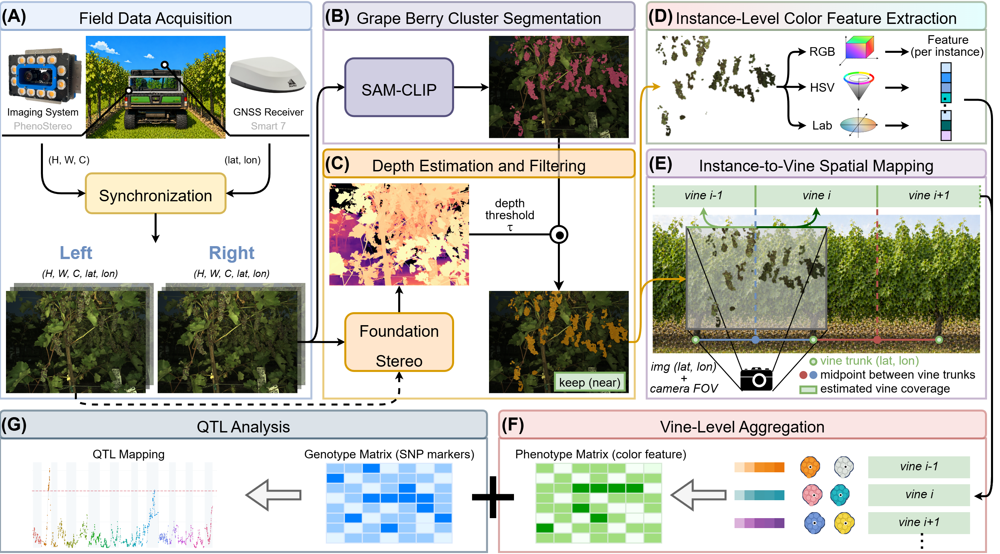
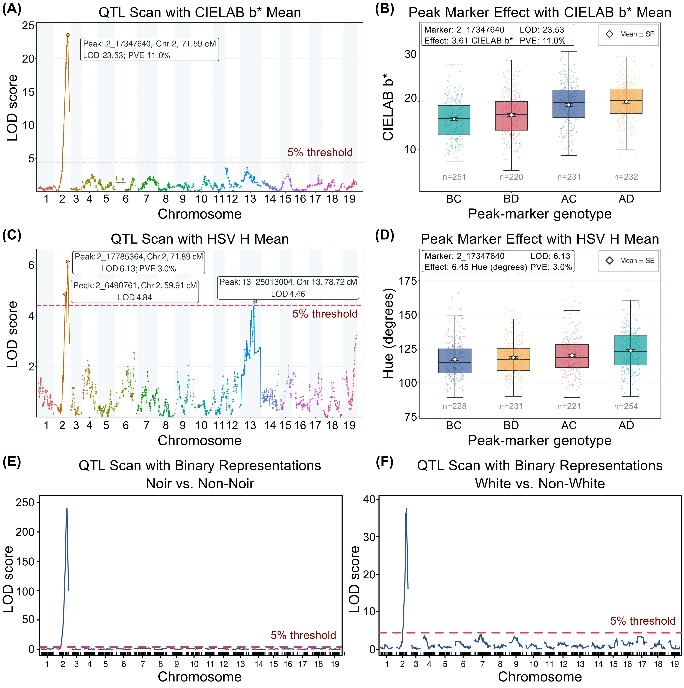

# Robot-Enabled Grape Berry Color Phenotyping and QTL Mapping

[Yiyuan Lin](https://yiyuanlinxx.github.io/), [Madan Pandey](https://www.linkedin.com/in/madan-pandey-975864196/), [Lance Cadle-Davidson](https://cals.cornell.edu/people/lance-cadle-davidson), [Matthew Clark](https://horticulture.umn.edu/people/matthew-clark), [Soon Li Teh](https://horticulture.umn.edu/people/soon-li-teh), [Yu Jiang](https://cals.cornell.edu/people/yu-jiang)

[[**`Paper`**](https://doi.org/10.13031/aim.202600399)] [[**`Project Page`**](https://yiyuanlinxx.github.io/publications/berry-color-asabe)] [[**`BibTeX`**](#citation)]

---

This is the official implementation of the workflow presented in our paper [Robot-Enabled Field Phenotyping of Grape Berry Cluster Color Using Multimodal Vision Foundation Models for Genetic Mapping](https://doi.org/10.13031/aim.202600399). The pipeline integrates stereo RGB imaging, vision foundation models, RTK-GPS-based spatial mapping, color feature extraction, and quantitative trait locus (QTL) analysis to transform field imagery into vine-level quantitative berry color phenotypes.

High-resolution stereo images were collected in a University of Minnesota research vineyard using a mobile imaging platform equipped with active strobe illumination and synchronized RTK-GPS. Grape berry clusters were segmented using [SAM-CLIP](https://github.com/YiyuanLinXX/SAM-CLIP), filtered using depth estimated by [FoundationStereo](https://github.com/NVlabs/FoundationStereo), assigned to individual vines through spatial mapping, and summarized in RGB, HSV, and CIE Lab color spaces for genetic analysis.

This compact repository contains the project-specific processing, spatial mapping, phenotype aggregation, and QTL analysis modules. SAM-CLIP and FoundationStereo are maintained as pinned external dependencies so that their upstream source trees and model weights are not duplicated here.

<p align="center">
  
</p>

<p align="center"><em>Overview of the proposed field phenotyping pipeline.</em></p>

## Repository Structure

```text
.
├── config/                         # Study, camera, phenotyping, and QTL parameters
├── data/processed/
│   ├── qtl/                        # Genotype map and vine-level phenotype tables
│   └── spatial/                    # Frame GPS records and surveyed vine coordinates
├── docs/                           # Data, methods, schema, licensing, and release notes
├── results/paper/                  # Selected reference results from the paper
├── scripts/
│   ├── vision/                     # Depth filtering, instance export, and color features
│   ├── depth/                      # FoundationStereo batch adapter and utilities
│   ├── spatial/                    # Frame-to-vine and instance-to-vine mapping
│   ├── analysis/                   # Vine aggregation and depth-filter sensitivity analysis
│   └── qtl/                        # Continuous and categorical QTL analyses
├── tests/                          # Lightweight tests for core vision utilities
├── environment.yml                # Python analysis environment
├── environment-qtl.yml            # R/QTL environment
└── external-dependencies.lock      # Reproducible upstream repository revisions
```

## Pre-requisites

We recommend using **Conda** and keeping the lightweight analysis environment separate from the GPU environments required by SAM-CLIP and FoundationStereo.

```bash
conda env create -f environment.yml
conda activate berry-color-qtl
```

Create the QTL environment separately:

```bash
conda env create -f environment-qtl.yml
conda activate berry-color-qtl-r
```

The segmentation and stereo-depth stages require a CUDA-capable GPU, their respective upstream environments, and separately obtained model checkpoints. The spatial mapping and QTL stages can be reproduced from the processed tables included in this repository.

## Getting Started

### Step 1: Prepare External Models

Clone the exact SAM-CLIP and FoundationStereo revisions recorded in `external-dependencies.lock`:

```bash
bash scripts/setup_external_dependencies.sh
```

This command places both repositories under the ignored `external/` directory. Follow each upstream repository's instructions to create its environment and obtain the required checkpoints; model weights are intentionally not downloaded or tracked by this repository.

### Step 2: Berry Cluster Segmentation and Stereo Depth

Run SAM-CLIP inference with the prompt `grape berry cluster`:

```bash
python external/SAM-CLIP/inference_sam_clip.py \
  --checkpoint_dir /path/to/berry_checkpoint \
  --image_dir /path/to/right_camera_rgb \
  --output_dir results/generated/masks \
  --text_prompt "grape berry cluster"
```

Estimate right-view metric depth from synchronized stereo image pairs:

```bash
python scripts/depth/run_foundation_stereo_pairs.py \
  --foundation_stereo_root external/FoundationStereo \
  --left_dir /path/to/left_camera_rgb \
  --right_dir /path/to/right_camera_rgb \
  --intrinsic_file /path/to/K_and_baseline.txt \
  --ckpt_dir /path/to/model_best_bp2.pth \
  --out_dir results/generated/depth \
  --output_view right \
  --get_pc 0
```

### Step 3: Depth Filtering and Color Feature Extraction

Filter segmented masks by scene depth, export connected berry-cluster instances, and extract RGB, HSV, and Lab descriptors:

```bash
python scripts/vision/filter_masks_by_depth.py \
  --mask_dir results/generated/masks \
  --depth_dir results/generated/depth \
  --csv_file data/processed/spatial/frame_gps.csv \
  --out_dir results/generated/phenotyping/berry_depth_filtered_60 \
  --keep_percentile 60

python scripts/vision/export_mask_instances.py \
  --mask_dir results/generated/phenotyping/berry_depth_filtered_60 \
  --out_dir results/generated/phenotyping/berry_instance_depth_filtered_60 \
  --min_component_area 200 \
  --output_layout flat

python scripts/vision/extract_instance_color_features.py \
  --instance_dir results/generated/phenotyping/berry_instance_depth_filtered_60 \
  --image_dir /path/to/right_camera_rgb \
  --out_csv results/generated/features/berry_cluster_instance_color_features_depth_filter_60.csv \
  --instance_layout flat \
  --save_masked_crop 0
```

The paper evaluates retention thresholds of `20`, `40`, `60`, `80`, and `100`, where `100` is the unfiltered reference.

### Step 4: Spatial Mapping and Vine-Level Phenotypes

Reproduce the frame-to-vine coverage table using the included RTK-GPS and vine survey data:

```bash
bash scripts/run_spatial_mapping.sh
```

The mapping uses the recorded camera offset, horizontal field of view, row geometry, and maximum viewing distance defined in `config/study_parameters.yml`. Instance-to-vine assignment and vine-level feature aggregation can then be run as described in [docs/METHODS.md](docs/METHODS.md).

### Step 5: QTL Analysis

Run a short smoke test for the primary `lab_b_mean` phenotype:

```bash
N_PERM=2 TRAITS=lab_b_mean \
OUT_DIR=results/generated/qtl/smoke_lab_b \
Rscript scripts/qtl/run_continuous_qtl.R
```

Run the complete continuous-trait analysis with 1,000 permutations:

```bash
N_PERM=1000 bash scripts/qtl/run_qtl_batch.sh
```

Run the categorical berry color comparison:

```bash
N_PERM=1000 Rscript scripts/qtl/run_binary_qtl.R
```

Continuous traits are analyzed using a four-way cross and Haley-Knott regression. The image-derived phenotypes recover a major QTL on chromosome 2 that is consistent with the categorical berry color analysis.

<p align="center">
  
</p>

<p align="center"><em>Comparison of Genome-wide QTL scan results derived from image-based continuous phenotypes at the 60% depth-retention threshold and manually assigned categorical berry color traits.</em></p>

## Verification

Run the repository integrity checks and unit tests before analysis or release:

```bash
python scripts/verify_repository.py
pytest -q
```

The complete verification target additionally checks Python compilation, shell syntax, and R syntax:

```bash
make verify
make test
```

## Data

This repository includes compact processed inputs for spatial mapping and QTL analysis. Raw stereo images, predicted depth arrays, segmentation masks, model checkpoints, and other large intermediate products are intentionally excluded. See [docs/DATA.md](docs/DATA.md) for the complete data inventory, expected external archive layout, and data availability boundary.

The software license does not cover the included data. Before a public release, confirm redistribution permission for the genotype map, phenotype tables, vineyard coordinates, timestamps, and categorical labels, then add an explicit data license. See [docs/RELEASE_CHECKLIST.md](docs/RELEASE_CHECKLIST.md) for the remaining release decisions.

## Acknowledgement

Berry cluster segmentation is based on our [SAM-CLIP](https://github.com/YiyuanLinXX/SAM-CLIP) framework. Stereo depth estimation uses [FoundationStereo](https://github.com/NVlabs/FoundationStereo). Please follow the upstream repositories for installation, checkpoints, licenses, and model-specific citations.

## License

Original code in this repository is released under the [MIT License](LICENSE). The FoundationStereo adapter and copied license text remain subject to the NVIDIA FoundationStereo license. Data are not covered by the software license. See [docs/THIRD_PARTY.md](docs/THIRD_PARTY.md) and `LICENSES/` before redistribution or commercial use.

## Citation

Please cite our paper if you find this code or workflow helpful:

```bibtex
@inproceedings{Lin2026RobotEnabledBerryColor,
  title = {Robot-Enabled Field Phenotyping of Grape Berry Cluster Color Using Multimodal Vision Foundation Models for Genetic Mapping},
  author = {Lin, Yiyuan and Pandey, Madan and Cadle-Davidson, Lance and Clark, Matthew and Teh, Soon Li and Jiang, Yu},
  booktitle = {2026 ASABE Annual International Meeting},
  year = {2026},
  paper = {2600399},
  publisher = {American Society of Agricultural and Biological Engineers},
  address = {St. Joseph, Michigan},
  doi = {10.13031/aim.202600399},
  url = {https://doi.org/10.13031/aim.202600399}
}
```
